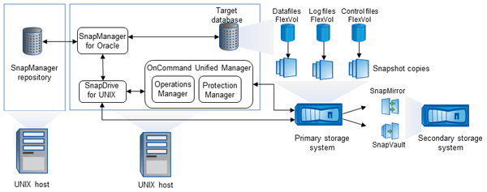

= Arquitetura da SnapManager
:allow-uri-read: 
:icons: font
:imagesdir: ../media/

[role="lead"]
O SnapManager para Oracle inclui componentes que trabalham em conjunto para fornecer uma solução abrangente e avançada de backup, restauração, recuperação e clonagem para bancos de dados Oracle.

== SnapDrive para UNIX

O SnapManager exige que o SnapDrive estabeleça conexão com o sistema de storage. Você deve instalar o SnapDrive para UNIX em cada host de banco de dados de destino antes de instalar o SnapManager.

== SnapManager para Oracle

Você deve instalar o SnapManager para Oracle em cada host de banco de dados de destino.

Você pode usar a interface de linha de comando (CLI) ou a IU do host de banco de dados onde o SnapManager for Oracle está instalado. Você também pode usar a IU do SnapManager remotamente usando um navegador da Web de qualquer sistema executado em um sistema operacional suportado pelo SnapManager.

NOTE: As versões JRE suportadas são 1,5, 1,6, 1,7 e 1,8.

== Banco de dados de destino

O banco de dados de destino é um banco de dados Oracle que você deseja gerenciar usando o SnapManager executando operações de backup, restauração, recuperação e clone.

O banco de dados de destino pode ser um RAC (Real Application clusters) autônomo ou residir em volumes de ASM (Automatic Storage Management) do Oracle. Para obter detalhes sobre as versões, configurações, sistemas operacionais e protocolos de banco de dados Oracle compatíveis, consulte a ferramenta de Matriz de interoperabilidade do NetApp.

== Repositório SnapManager

O repositório do SnapManager reside em um banco de dados Oracle e armazena metadados sobre perfis, backups, restauração, recuperação e clone. Um único repositório pode conter informações sobre operações executadas em vários perfis de banco de dados.

O repositório SnapManager não pode residir no banco de dados de destino. O banco de dados do repositório do SnapManager e o banco de dados de destino devem estar online antes de executar operações do SnapManager.

== Pacote principal do OnCommand Unified Manager

O pacote básico do OnCommand Unified Manager integra os recursos do Gerenciador de operações, do Gerenciador de proteção e do Gerenciador de provisionamento. Ele centraliza políticas de provisionamento, clonagem, backup e recuperação e recuperação de desastres (DR). A integração de todos esses recursos possibilita a execução de muitas funções de gerenciamento a partir de uma única ferramenta.

== Operations Manager

O Operations Manager é a interface de usuário (UI) baseada na Web do pacote básico do OnCommand Unified Manager. Ele é usado para monitoramento diário do storage, emissão de alertas e geração de relatórios sobre a infraestrutura do sistema de storage e storage. A integração com o SnapManager utiliza os recursos RBAC do Operations Manager.

== Gerenciador de proteção

O Protection Manager oferece aos administradores um console de gerenciamento fácil de usar para configuração e controle rápidos de todas as operações do SnapMirror e do SnapVault. A aplicação permite que os administradores apliquem políticas consistentes de proteção de dados, automatizem processos complexos de proteção de dados e agrupem recursos de backup e replicação para maior utilização.

A interface do Gerenciador de proteção é o Console de Gerenciamento NetApp, a plataforma cliente para aplicativos de software de gerenciamento NetApp. O Console de Gerenciamento da NetApp é executado em um sistema Windows ou Linux diferente do servidor no qual o servidor OnCommand está instalado. Ele permite que os administradores de storage, aplicativos e servidores executem tarefas diárias sem ter que alternar entre diferentes UIs. Os aplicativos executados no Console de Gerenciamento do NetApp são o Gerenciador de proteção, o Gerenciador de provisionamento e o consultor de desempenho.

== Sistema de storage primário

O SnapManager faz backup dos bancos de dados de destino no sistema de storage primário NetApp.

== Sistema de storage secundário

Quando você ativa a proteção de dados em um perfil de banco de dados, os backups criados no sistema de storage primário pela SnapManager são replicados para um sistema de storage NetApp secundário que usa as tecnologias SnapVault e SnapMirror.

*Informações relacionadas*

http://mysupport.netapp.com/matrix["Ferramenta de Matriz de interoperabilidade do NetApp"]
